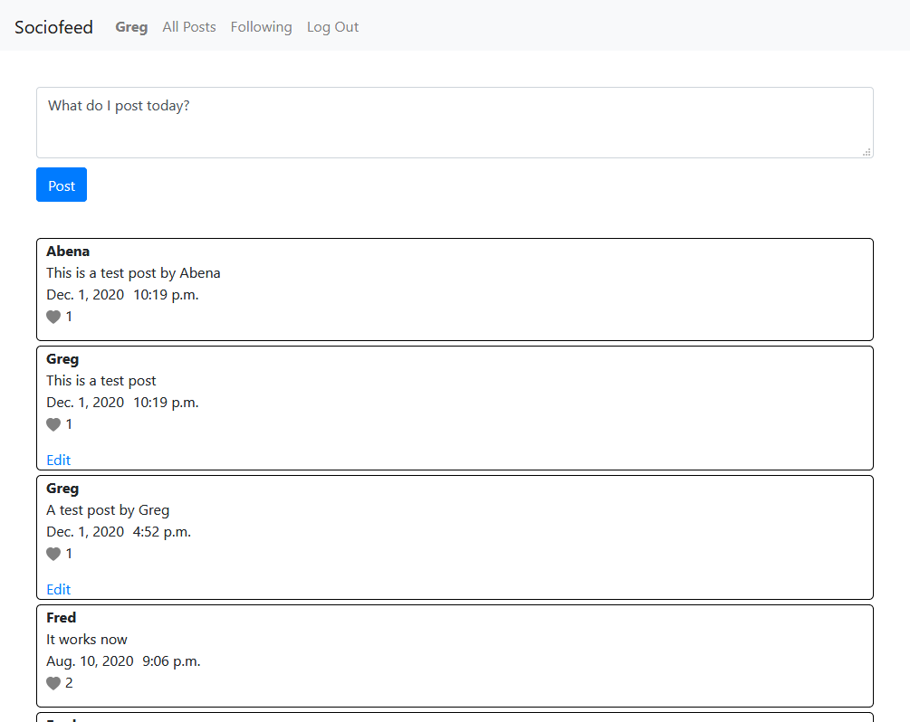
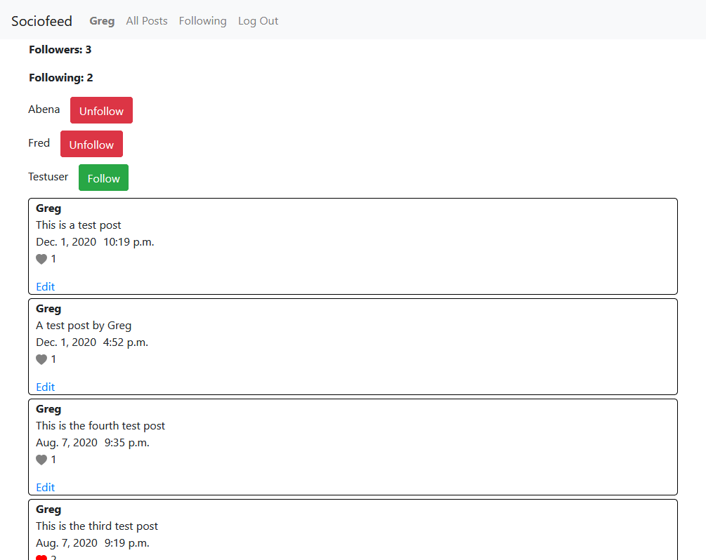
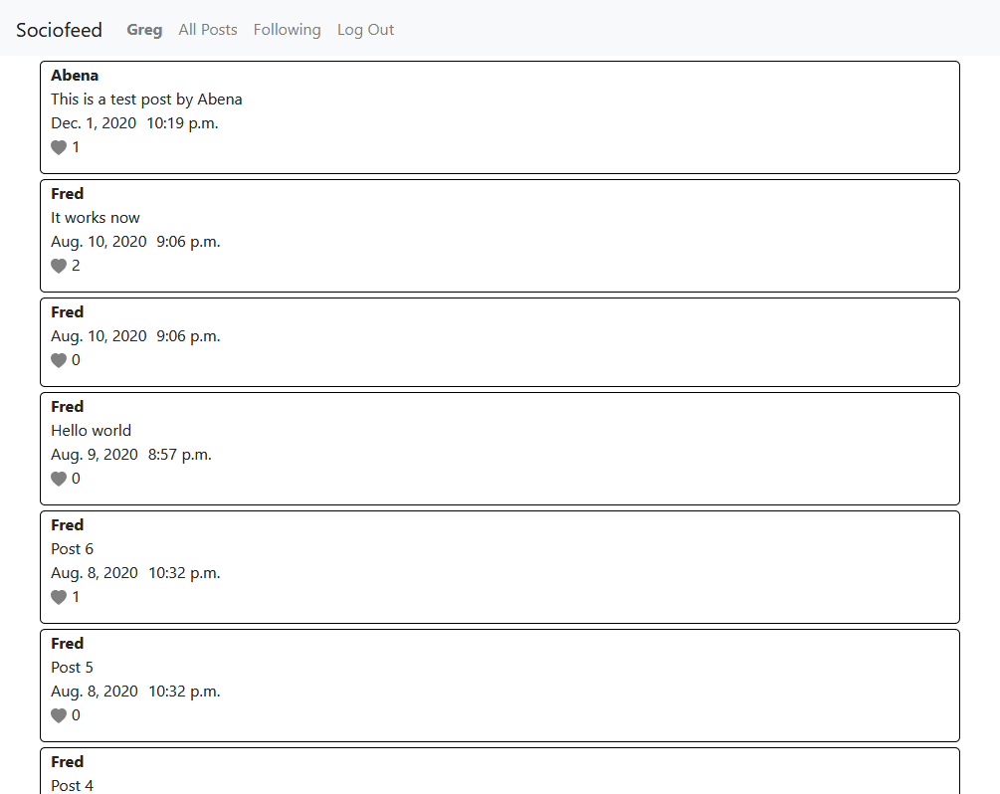

# Sociofeed Overview

Sociofeed is a social media application that allows users to follow and unfollow other users, post and like posts. These data - posts, followers and following, likes and users - are stored in a database.

## Registration
Before a user can use this application, s/he must register using a unique username and his/her email address.

## Homepage
Post registration/login, the user is redirected to the homepage of the web app. Here, the user can view posts by all users, write and post his/her posts.

## Profile
When a user clicks on his/her username, the user is taken to a page where s/he can see the number of followers s/he has, number of users s/he is following, follow users, unfollow users and also view all posts by the user.

PS: Users can edit posts but only posts posted by them

## Following
On this page, the user views all post by users who the user follows.

# Files

## Back end

### [network/models.py](network/models.py "models.py")
This file contains all the program's models

### [network/urls.py](network/urls.py "urls.py")
This file contains all the web application's urls

### [network/views.py](network/views.py "views.py")
This file contains all the program's views.

### [network/templatetags/custom_template_tags.py](network/templatetags/custom_template_tags.py "custom_template_tags.py")
This contains custom template tags for the web application.

## Front end

## _Static_ - JavaScript

### [network/static/network/edit.js](network/static/network/edit.js)
JavaScript code that controls how posts are edited.

### [network/static/network/script.js](network/static/network/script.js)
General JavaScript code that controls how posts are liked.

## _Static files_ - SASS(SCSS)/CSS

### [network/static/network/styles.css](network/static/network/styles.css)
This is the CSS file for the general UI of the web application. This contains the design of the homepage, buttons and other elements of the application

### [network/static/network/styles.scss](network/static/network/styles.scss)
The is the SASS file for the general UI of the web application. This is later converted to **styles.css** for use by browsers.

## _templates_

### [network/templates/network/edit.html](network/templates/network/edit.html)
HTML for editting posts.

### [network/templates/network/following.html](network/templates/network/following.html)
HTML for Following page of the web application.

### [network/templates/network/index.html](network/templates/network/index.html)
HTML for the homepage of the application.

### [network/templates/network/layout.html](network/templates/network/layout.html)
General layout of the web application's UI. It has the navbar, general look of all pages. This is extended by other html files.

### [network/templates/network/login.html](network/templates/network/login.html)
Login page of the application

### [network/templates/network/profile.html](network/templates/network/profile.html)
HTML file of the profile page of the web application.

### [network/templates/network/register.html](network/templates/network/register.html)
Registration page of the web application.
